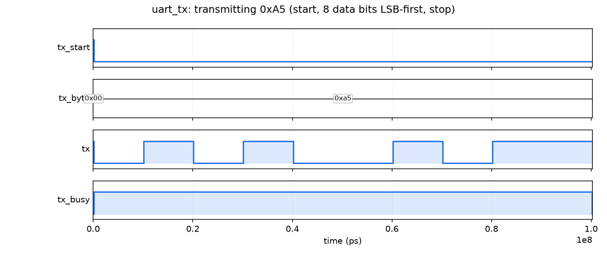
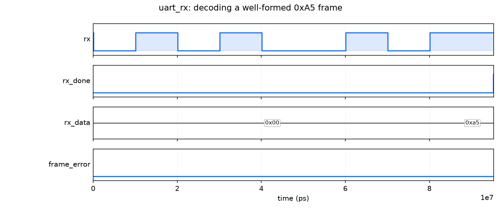
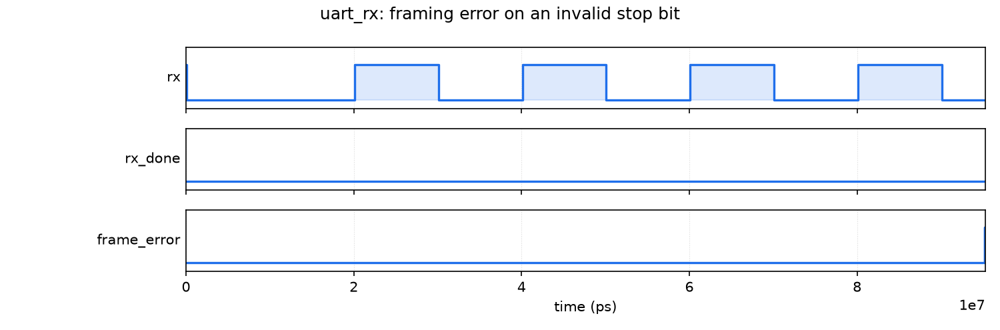
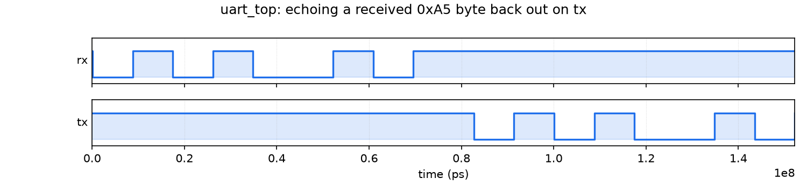

# UART Transceiver

A UART transmitter and receiver written in SystemVerilog, built as my first real FPGA project. It's targeting a Digilent Nexys4 DDR board. I mostly wanted to actually understand a UART at the RTL level instead of just instantiating one from an IP catalog, so everything here (rx, tx, and the framing logic) is hand-written. AI assistance was used for the verification tooling, not the RTL or its logic.

`uart_top` just takes whatever byte comes in on `rx` and sends it back out on `tx`.

I've flashed this onto the board and confirmed it over a USB-serial connection, so it's proven out on real hardware, not just in simulation.

## File breakdown

- **`rtl/uart_rx.sv`** — synchronizes the incoming `rx` line, waits for the start bit, samples each of the 8 data bits near the middle of its bit period, then checks the stop bit. Flags `frame_error` if the stop bit isn't right.
- **`rtl/uart_tx.sv`** — takes a byte and shifts it out LSB-first between a start bit and a stop bit. Holds `tx_busy` high the whole time it's sending.
- **`rtl/uart_top.sv`** — connects `uart_rx`'s output into `uart_tx`'s input for the echo.

Both `uart_rx` and `uart_tx` take `CLK_FREQ` and `BAUD_RATE` as parameters, and figure out how many clock cycles make up one bit period from those. `uart_top` sets both to 115200 baud on a 100 MHz clock, which is what the Nexys4 DDR's onboard clock and USB-UART bridge expect.

Pin constraints for the board are in [`constraints/Nexys4_DDR_chu.xdc`](constraints/Nexys4_DDR_chu.xdc) — it's the general Nexys4 DDR constraints file with just the clock and UART pins uncommented/wired up for this project.

## Simulation

I'm using [cocotb](https://www.cocotb.org/) with Icarus Verilog for simple, Python-based simulation.

The testbenches bit-bang actual UART frames onto `rx` and read them back off of `tx`, with the shared bit-timing logic living in `sim/uart_model.py`.

Coverage-wise: reset behavior, single-byte transfers across a handful of byte patterns, back-to-back bytes without gaps, `tx_busy` staying asserted for the full frame, and a deliberately corrupted stop bit to make sure `frame_error` actually trips.

To run everything:

```bash
cd sim
pip install -r requirements.txt
pytest -v
```

### Waveforms

`sim/render_waveforms.py` generates the waveform images below from simulation:

```bash
cd sim
python3 render_waveforms.py
```

**Transmitting 0xA5** — start bit, then the 8 data bits LSB-first (`1010 0101` comes out as `1,0,1,0,0,1,0,1`), then the stop bit. `tx_busy` stays high the whole time.



**Receiving that same byte** — `rx_done` pulses for one clock cycle once the stop bit checks out, with `rx_data` holding `0xA5`.



**A bad frame** — same byte, but the stop bit is held low instead of going back high. `frame_error` pulses instead of `rx_done`.



**The full loopback** — a byte comes in on `rx` and goes back out on `tx`.



## Layout

```
rtl/             the actual UART RTL
constraints/     Nexys4 DDR XDC file
sim/             cocotb testbenches + waveform script
docs/waveforms/  PNGs generated by render_waveforms.py
```

## What's left

It works, and it's running on hardware, but there's more I want to do:

- Make the baud rate on `uart_top` configurable instead of hardcoded to 115200
- Add flow control (CTS/RTS) — the pins exist on the board but I'm not using them yet
- Maybe wrap this in something more interesting than an echo, like a tiny command interface over the serial link
